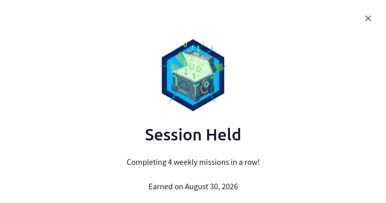

August has been an absolute whirlwind,

Things I've done since last time:

I somehow didn't write anything about the **Antisyphon Training Infosec: Age of AI Summit** I went to the day before I last posted (Aug 14th). You can watch the recording here: https://www.youtube.com/live/66xD4K6eeB0.

I did work through about 5 more of the SOC 2 path rooms, while I didn't win the raffle, I did learn a bunch about Microsoft Entra ID logs.

I did a bunch of other THM rooms, including some on AI, keeping my streak alive and earning a badge for completing 4 weekly missions in a row.

I revisited the Infosec Wizard SOC CTF more in-depth by following along with other peoples write-ups.
I hosted a community stream on the Infosec Wizard discord and attended a couple.

I played the August Skillbit (formerly metactf) flash CTF and right afterwords played the dirtbags and flags CTF also on Skillbit (formerly metactf). 

I met the point cutoff and got Skillbit Pro Labs Subscription! Huge thanks to everyone to helped make such an awesome CTF possible!!

I applied for and got a mini-grant - part of which I was able to put towards Deathcon (https://deathcon.io/ I'll be attending online!) as well as towards THM premium. Extremely grateful for all the help!