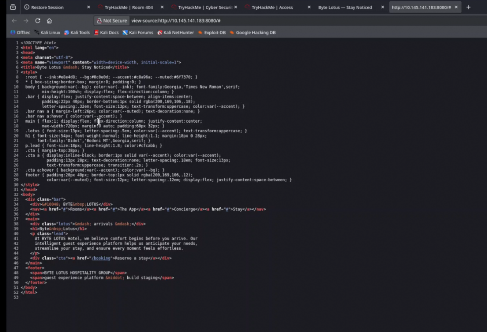
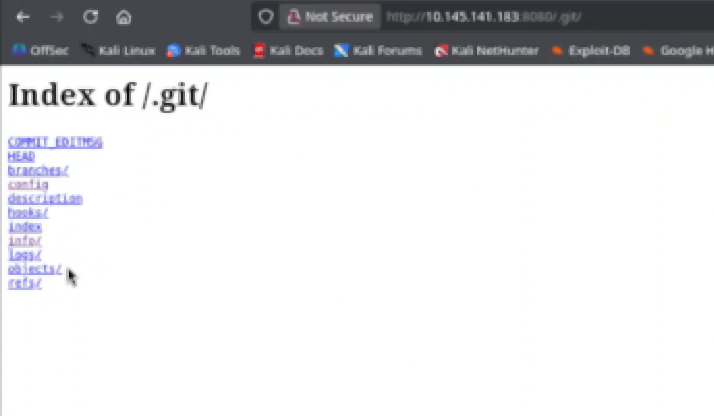

Looking at the room description and tags (web, enumeration) it talked about rooms and source code, I made some initial assumptions to direct my investigation.
1. There may be something hidden in the web page source code.
2. There may be an undocumented directory (room) that I need to find so I should break out gobuster.

Both of these assumptions, set me up to take longer than I should have, but I still got to my solution eventually. The room is listed at 30 mins, it took me about an hour and 45 minutes.

Note: I had only given my Kali VM 4GB of RAM which also hurt me, I went back and bumped it up to 16GB after this.

Because this was an actual box and not all web based like Brochure I first had to go and grab the openvpn configuration from tryhackme.com/manage-account/access

I started it up in one terminal via 
```
sudo openvpn usernameandvmregion.ovpn
```
I then pinged the room VM IP to confirm that I was successfully connected.

From there I went to the initial web page and inspected the source.


From there I took a look at booking and inspected the 404 to make sure it was a normal page without anything hidden in the source.

I looked up some gobuster cheatsheets to reference after poking around the source page a bit more and manually trying some directories such as /flag.

I settled on 
```
gobuster -u http://VMIP:8080 -w /usr/share/wordlists/wordlist goes here
```

I went through several wordlists before finding one that found what I needed. (dirb/common.txt) I also added a / after the port number, I'm not sure if that had effect, I could search the other wordlists for .git/HEAD to see if that could have been the problem.
 
I also ended up adding -o so I could have an output file to tail in another terminal.

```
gobuster -u http://VMIP:8080/ -w /usr/share/wordlists/dirb/common.txt -o output.txt

tail -f output.txt
.git/head
```

I tried to curl the .git which didn't work.
I went to .git/HEAD and it showed me /refs/heads/main. I tried to clone into .git/HEAD and some other stuff that didn't work before adding an hour to the machine.

I DDGed /ref/heads/main, read a little and then tried some more paths in the browser and got
.git/heads/main which gave me the hash for one of the commits. Not that I recognized it at the time.
I tried to pull it with the hash as part of the path. I tried putting the hash in cyberchef/

I tried a bunch of different paths with the hash and read about commits and hashes.

After that I asked AI about the paths and I was able to confirm that git config and objects existed. I started poking around .git/objects, but I ran into a bunch of 404s.
The exclude and info files weren't too helpful but gave me hope.

The AI started telling me about packed objects and I started looking around using the hash again, but with the first two characters as an initial directory with the rest of it as the next layer down.

I also tried looking under /pack.
I somehow had a realization and tried .git.

I went through each link and looked at some of the different files. I finally went to .git/objects again and this time there were packed commit files! IDEK why it didn't work the first time I was there. I manually downloaded the file and of course I ran strings on it, which didn't help.

I tried to clone it again. Then I tried to use git-cat file which didn't work out either.
I finally thought to use the file command and figured out that they were zlib compressed, confirming what the AI had suggested earlier.
I did some googling to figure out how to un-compress them. The AI overview was actually right on the first try. 
I had to install the tool first with 
```
sudo apt install qpdf
```

which gives us zlib-flate
I uncompressed the commit file with

```
zlib-flate < hashfilenamegoeshere > output.txt
```

It didn't have the flag so I repeated the process until I found an older commit that had the flag with a note to not deploy the folder to production.

Prevention: 
- .gitignore should always be in place with relevant exclusions.
- Reverse proxies should be configured to explicitly deny . prefix directories.
- Git archive can be used to export the contents without including the Git history.
- Secrets scanning + a pre-commit hooks could have prevented the flag from being committed in the first place, the flag belongs in a vault not as a note in a staging commit.